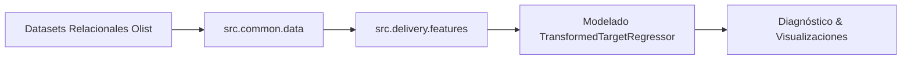
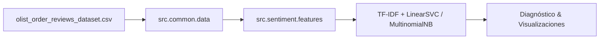
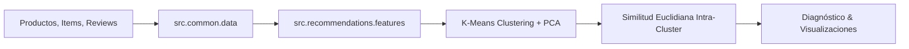

# 📦 Olist Store — Machine Learning Platform

> Sistema modular de Machine Learning para e-commerce (Olist Brasil). Implementa pipelines desacoplados para predicción de tiempos de entrega, análisis de sentimiento en reseñas y recomendación personalizada de productos con validación y trazabilidad completa.

---

## 🎯 Dominios de Negocio

### 1. 🚚 Predicción de Tiempos de Entrega
Predecir con precisión los **días reales de entrega** (`target_days`) de una orden para optimizar la promesa de entrega al cliente, detectar fricciones logísticas interestatales y reducir costos operativos.



### 2. 💬 Análisis de Sentimiento en Reseñas (NLP)
Clasificar reseñas en lenguaje natural en **Positivas (1)** o **Negativas (0)** mediante **TF-IDF** y modelos lineales, priorizando la detección de clientes insatisfechos (*Recall Negativo*) para mitigación de *churn* y soporte proactivo.



### 3. 🛍️ Sistema de Recomendación de Productos (Clustering & K-Means)
Segmentar el catálogo en clusters de comportamiento comercial homogéneo (**K-Means + PCA**) para recomendar artículos de la **misma categoría y gama similar** calculando distancias euclidianas intra-cluster.



---

## 🏛️ Arquitectura del Repositorio (*Screaming Architecture*)

La estructura del código está desacoplada por dominios de negocio:

```text
olist_store/
├── datasets/                 # Datos relacionales de Olist (CSVs)
├── notebooks/
│   ├── 01_predict_delivery.ipynb           # Pipeline de predicción de tiempos de entrega
│   ├── 02_sentiment_analysis.ipynb         # Pipeline de análisis de sentimiento (NLP)
│   └── 03_product_recommendations.ipynb    # Pipeline de clustering y recomendación
├── src/
│   ├── common/               # Configuración central y cargadores comunes
│   │   ├── config.py         # Resolución determinista de rutas del proyecto
│   │   └── data.py           # Ingesta de tablas relacionales, reviews y productos
│   ├── delivery/             # Dominio: Tiempos de Entrega (Completado)
│   │   ├── features.py       # Haversine, cubicaje, merges y target
│   │   └── viz.py            # Scatter real vs pred, Permutation Importance, Residuos
│   ├── recommendations/      # Dominio: Recomendación de Productos (Completado)
│   │   ├── features.py       # Agregación por producto, log-transforms, K-Means y KNN
│   │   └── viz.py            # Método del codo, Silhouette Score y dispersión PCA 2D
│   └── sentiment/            # Dominio: Análisis de Reseñas NLP (Completado)
│       ├── features.py       # Preprocesamiento, stopwords NLTK y pipelines TF-IDF
│       └── viz.py            # Matrices de confusión y coeficientes Top 15
└── pyproject.toml            # Dependencias y configuración de build (uv + hatchling)
```

---

## 🚀 Inicio Rápido

### 1. Requisitos

- Python `>= 3.12`
- [`uv`](https://docs.astral.sh/uv/) (gestor de entornos y paquetes)

### 2. Instalación y Sincronización del Entorno

```bash
# Clona el repositorio y navega al directorio
cd olist_store

# Sincroniza dependencias e instala el paquete editable src
uv sync
```

### 3. Ejecución de Pipelines

Abrí los notebooks en Jupyter o VS Code seleccionando el kernel del entorno virtual (`.venv`):

```bash
# Pipeline de Entrega
uv run jupyter lab notebooks/01_predict_delivery.ipynb

# Pipeline de Análisis de Sentimiento (NLP)
uv run jupyter lab notebooks/02_sentiment_analysis.ipynb

# Pipeline de Recomendación de Productos (Clustering)
uv run jupyter lab notebooks/03_product_recommendations.ipynb
```

---

## 🔬 Pipeline de Entrega: Decisiones Técnicas Clave

| Etapa | Decisión Técnica | Justificación de Negocio / Matemática |
| :--- | :--- | :--- |
| **Ingeniería Geoespacial** | **Distancia Haversine** | Cálculo ortodrómico real sobre la curvatura terrestre entre cliente y vendedor. |
| **Consistencia Logística** | **Filtro Mono-vendedor** | Excluye órdenes con múltiples orígenes para evitar ambigüedad en origen y flete. |
| **Validación Temporal** | `shuffle=False` (70/30) | Evita *data leakage* cronológico (entrena con el pasado, prueba en el futuro). |
| **Heterocedasticidad** | $\log(1 + y)$ | `TransformedTargetRegressor` estabiliza la varianza y reduce el impacto de colas largas. |
| **Limpieza de Anomalías** | Recorte al percentil 99 | Elimina disputas y extravíos extremos (> percentil 99) conservando 93.777 órdenes. |

### 📊 Resultados de Entrega (Test Set - 30% cronológico)

| Modelo | MAE (Días) | RMSE (Días) | $R^2$ | Estado |
| :--- | :---: | :---: | :---: | :---: |
| **Dummy Regressor (Mediana)** | 5.21 | 6.48 | -0.0911 | *Baseline* |
| **Decision Tree Regressor** | 3.94 | 5.42 | 0.2368 | *Árbol simple* |
| **Random Forest Regressor** | 3.78 | **5.21** | **0.2939** | *Ensemble Bagging* |
| **HistGradientBoostingRegressor** | **3.75** | 5.22 | 0.2921 | 🏆 **Ganador (Producción)** |

---

## 🔬 Pipeline de Análisis de Sentimiento (NLP): Decisiones Técnicas Clave

| Etapa | Decisión Técnica | Justificación de Negocio / Matemática |
| :--- | :--- | :--- |
| **Rescate de Datos** | Concatenación Título + Mensaje | Rescata 1.650 reseñas que solo tenían título, maximizando la información disponible. |
| **Filtro de Ruido** | Exclusión de 3 estrellas | Elimina ambigüedad neutra y enfoca la clasificación en polaridades claras (1-2 vs 4-5). |
| **Validación Temporal** | `shuffle=False` (80/20) | Emula el escenario productivo clasificando reseñas futuras con datos pasados. |
| **Stop Words Quirúrgicas** | Exclusión de Negaciones | Conserva `nao`, `nunca`, `jamais`, etc., para evitar inversión de polaridad en el vectorizador. |
| **Desbalance de Clases** | `class_weight="balanced"` | Penaliza fuertemente los errores en la clase minoritaria (Negativa, ~21% en test). |

### 📊 Resultados de Sentimiento (Test Set - 20% cronológico)

| Modelo | Accuracy | F1 Negativo | Recall Negativo | F1 Positivo | ROC-AUC | Estado |
| :--- | :---: | :---: | :---: | :---: | :---: | :---: |
| **Multinomial Naive Bayes** | **94.95%** | 0.8850 | 89.65% | **0.9677** | 0.9809 | *Baseline Probabilístico* |
| **Linear SVM (Balanced)** | 94.90% | **0.8880** | **93.26%** | 0.9670 | **0.9828** | 🏆 **Ganador (Producción)** |

> 💡 **Métrica Reina de Negocio**: `Recall Negativo (93.26%)`. Minimiza reseñas de clientes descontentos que pasan desapercibidas, permitiendo intervención operativa proactiva.

---

## 🔬 Pipeline de Recomendación de Productos: Decisiones Técnicas Clave

| Etapa | Decisión Técnica | Justificación de Negocio / Matemática |
| :--- | :--- | :--- |
| **Agregación a Nivel Producto** | Promedios ponderados e imputación | Modela 32.951 productos consolidando precio, flete, ventas y review medio. |
| **Estabilización de Distribuciones** | Transformación $\log(1 + x)$ | Suprime asimetrías extremas en precios y ventas para evitar distorsiones euclidianas. |
| **Selección de K Óptimo** | Método del Codo + Silhouette Score | Evalúa $K \in [2,7]$ seleccionando $K=5$ por máxima cohesión y separación. |
| **Recomendación Híbrida** | Restricción Categorial + Similitud Intra-cluster | Garantiza coherencia de categoría y similitud en gama y comportamiento comercial. |

### 📊 Perfiles de Clusters de Catálogo (K=5)

| Cluster | Segmento Comercial | Precio Medio | Flete Medio | Review Score | Ventas | % Catálogo |
| :---: | :--- | :---: | :---: | :---: | :---: | :---: |
| **0** | Ultra-Económico / Flete Crítico | $20.65 | $18.19 | 4.21⭐ | 2.22 | 11.77% |
| **1** | Gama Media / Satisfecho | $92.71 | $15.16 | 4.70⭐ | 1.53 | 42.34% |
| **2** | Alta Rotación / Best Sellers | $94.21 | $18.01 | 4.05⭐ | 14.91 | 13.27% |
| **3** | Baja Calificación / Riesgo | $116.67 | $18.07 | 1.88⭐ | 1.54 | 15.76% |
| **4** | Premium / High-Ticket | $431.53 | $43.93 | 4.32⭐ | 1.82 | 16.85% |

> 📈 **Métricas Globales de Agrupamiento**: Calinski-Harabasz: `10011.06` | Davies-Bouldin: `1.0833`.

---

## 🛠️ Calidad de Código y Estándares

El proyecto cumple con estándares estrictos de tipado y estilo:

```bash
# Verificación de linters y formato
uv run ruff check src/
uv run ruff format --check src/

# Verificación de tipos estática
uv run --with pyright pyright src/
```


